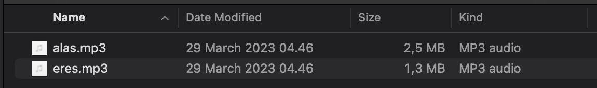
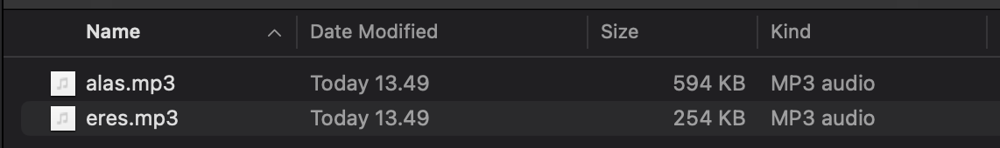
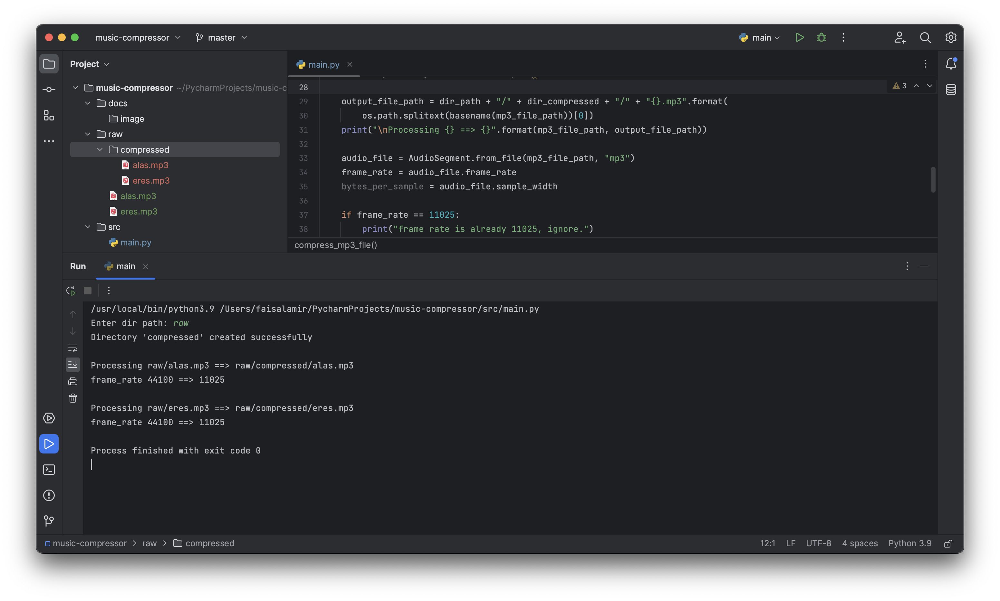

## Music Compressor
- v1.0.0 Development

## Screen Shot

### Before Compress

### Result Compress

### Runer

## Reference
- w3school.com - https://www.w3schools.com/python

## Tools
- Python (SDK) - https://www.python.org/downloads/
- PyCharm JetBrain Community (IDE) - https://www.jetbrains.com/pycharm/download/download-thanks.html?platform=windows&code=PCC
- Git (Windows) - https://git-scm.com/download/win 

## Colaborator
Very open to anyone, I'll write your name under this, please contribute by sending an email to me

- Mail To faisalamircs@gmail.com
- Subject : Github _ [Github-Username-Account] _ [Language] _ [Repository-Name]
- Example : Github_amirisback_kotlin_admob-helper-implementation

Name Of Contribute
- Muhammad Faisal Amir
- Waiting List
- Waiting List

Waiting for your contribute

## Attention !!!
- Please enjoy and don't forget fork and give a star
- Don't Forget Follow My Github Account